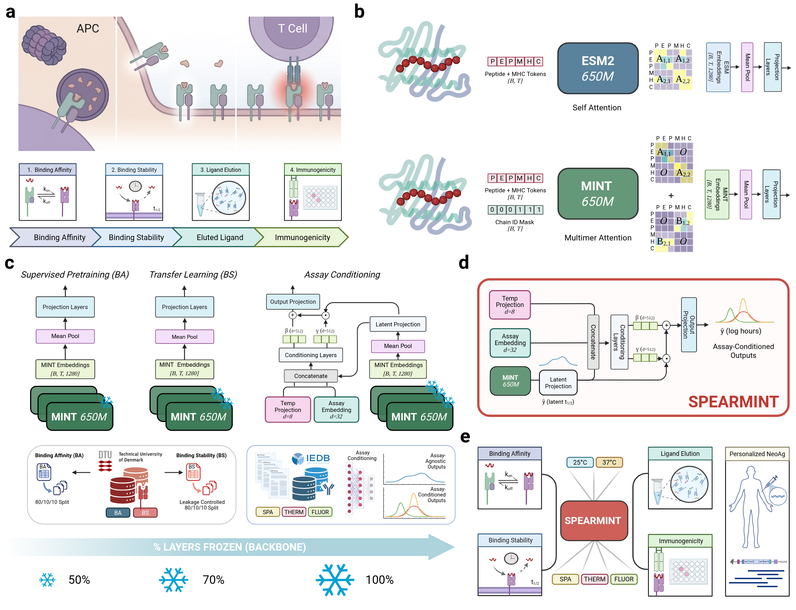

# 🌿🧬🧫 SPEARMINT: Peptide:MHC Binding Stability Prediction Using Protein Language Models

<!--
[](https://doi.org/XX.XXXX/zenodo.XXXXXXX)
[](https://doi.org/XX.XXXX/journal)
-->

Predicting the stability of peptide–MHC class I (pMHC-I) complexes is a key component of modeling antigen
presentation and prioritizing immunotherapy targets, yet stability measurements are scarce, noisy, and
fragmented across assays whose measured values lack cross-assay consistency. In this work we build on **[MINT](https://github.com/VarunUllanat/mint)**, a multimer-aware ESM2 protein language model whose cross-chain attention operates over the full peptide and MHC sequences (rather than
a fixed pseudo-sequence), and adapt it to stability prediction through staged transfer learning inspired by **[TLStab](https://github.com/KavrakiLab/TL-MHC/tree/master/TLStab)**. We first fine-tune on the abundant peptide–MHC binding-affinity signal, before transfering those representations to the smaller stability (half-life) regime, and finally learn an assay-aware recalibration head that conditions predictions on **assay type and temperature**. This conditioning lets a single model learn jointly from heterogeneous multi-assay datasets while remaining grounded to a common reference condition. We release the trained weights on [HuggingFace](https://huggingface.co/collections/dkarthikeyan1/spearmint) for ease of use, and use this repository as a store of data, configs, and code needed to retrain the models.



### How to use

For the easiest way to try out the models, we make the trained weights available on the HuggingFace Hub as self-contained `trust_remote_code` modules, so users do not need to install this repository. Simply load a model directly with `transformers` in a few
seconds (see [Model Usage](#model-usage) below). All three stages are available here:


 * [MINT Stage 1 Affinity](https://huggingface.co/dkarthikeyan1/mint-stage1-affinity)
 * [MINT Transfer Stage 2 Stability](https://huggingface.co/dkarthikeyan1/mint-stage2-stability)
 * [SPEARMINT Stage 3 Assay-Conditioned](https://huggingface.co/dkarthikeyan1/spearmint)

| Stage | Class | Task | Output |
|-------|-------|------|--------|
| **S1** | `MintStabilityForRegression` | Peptide-MHC binding affinity | $1 - \frac{\log(\text{IC50}_{\text{nM}})}{\log(50000)}$ |
| **S2** | `MintStabilityForRegression` | Stability (half-life) | `log1p(hours)` |
| **S3** | `SpearmintForStabilityPrediction` | Assay/temperature-conditioned stability | `log1p(hours)` |

> **Sequence note:** provide the **full MHC class I alpha-chain sequence** (~365 residues), *not* a
> 34-residue pseudo-sequence. MINT's multimer attention models residue-level cross-chain interactions, so
> the complete sequence carries signal a pseudo-sequence discards. For examples of common alleles, check out `refs/`.

### Model Usage

The flagship **SPEARMINT** model (Stage 3) predicts pMHC-I stability conditioned on assay type and
temperature. Load it straight from the HF Hub with `trust_remote_code=True` no local installation required.

**Single prediction:**

```python
import math
import torch
from transformers import AutoModel
from transformers.dynamic_module_utils import get_class_from_dynamic_module

# Architecture + weights, straight from the Hub
model = AutoModel.from_pretrained("dkarthikeyan1/spearmint", trust_remote_code=True)
model.eval()

# Matching tokenizer, loaded from the same remote module
SpearmintTokenizer = get_class_from_dynamic_module(
    "modeling_spearmint.SpearmintTokenizer",
    "dkarthikeyan1/spearmint",
    trust_remote_code=True,
)
tokenizer = SpearmintTokenizer()

peptide = "GILGFVFTL"
mhc_sequence = "MAVMAPRTLLLLLSGALALTQTWAG..."  # full MHC-I heavy (alpha) chain

chains, chain_ids, assay_idxs, temp_floats = tokenizer.prepare_input(
    peptide, mhc_sequence,
    assay="SPA",            # one of: SPA, Purified_Fluor, Cellular_Fluor, Other
    temperature_c=37.0,     # temperature in Celsius
)

with torch.no_grad():
    output = model(chains.unsqueeze(0), chain_ids.unsqueeze(0), assay_idxs, temp_floats)
    log_pred = output["logits"].item()          # model outputs log1p(half-life in hours)
    predicted_halflife_hours = math.expm1(log_pred)

print(f"Predicted half-life: {predicted_halflife_hours:.2f} hours")
```

**Batch inference:**

```python
peptides = ["GILGFVFTL", "NLVPMVATV"]
mhc_sequences = ["MAVMAPRTL...", "MAVMAPRTL..."]   # full sequences
assays = ["SPA", "Cellular_Fluor"]
temps = [37.0, 25.0]

chains, chain_ids, assay_idxs, temp_floats = tokenizer.prepare_batch(
    peptides, mhc_sequences, assays=assays, temperatures_c=temps,
)

with torch.no_grad():
    output = model(chains, chain_ids, assay_idxs, temp_floats)
    log_preds = output["logits"].squeeze(-1)
    predictions_hours = torch.expm1(log_preds)   # half-life in hours, per pair
```

The Stage 1 (binding) and Stage 2 (stability) models load the same way via
`AutoModel.from_pretrained(..., trust_remote_code=True)` with `MintTokenizer` (no `assay` /
`temperature_c` arguments). **Stage 2** outputs `log1p(hours)` like Stage 3 — apply
`math.expm1(...)` to the logit to recover half-life in hours. **Stage 1** outputs the
binding-affinity score directly in `[0, 1]` (no transform).

### Model Retraining 

If you would like **train, re-train, or contribute** then you can easily install the contents of this repository using pip:

```bash
# from the repository root — only needed for training / conversion / development
pip install -e src/
```

Each stage reads `train.csv` / `val.csv` / `test.csv` from a data directory and writes a checkpoint:

```bash
# Stage 1 — binding affinity
python -m mint_stability.train_binding   --config configs/s1_binding_args.json    --checkpoint_path <mint.ckpt>

# Stage 2 — stability (transfers from Stage 1)
python -m mint_stability.train_stability --config configs/s2_stability_args.json  --mint_checkpoint <mint.ckpt>

# Stage 3 — assay-conditioned SPEARMINT (FiLM)
python -m mint_stability.train_stage3    --config configs/s3_film_v2_args.json    --mint_checkpoint <mint.ckpt>
```

Default hyperparameters per stage are in `configs/`. Run the test suite with `python -m pytest`.


### Repository Structure

```
spearmint/
├── src/mint_stability/      # Installable package
│   ├── backbone.py            # Inlined ESM2-650M backbone (multimer attention)
│   ├── modeling_mint.py       # S1/S2 model (MintStabilityForRegression)
│   ├── modeling_spearmint.py  # S3 FiLM model (SpearmintForStabilityPrediction)
│   ├── modeling_base.py        # Shared PreTrainedModel base (fail-closed loading)
│   ├── configuration_*.py     # HuggingFace configs
│   ├── tokenizer.py           # Peptide+MHC tokenizers (Mint / Spearmint)
│   ├── train_binding.py       # Stage 1 training
│   ├── train_stability.py     # Stage 2 training
│   ├── train_stage3.py        # Stage 3 training (Accelerate, multi-GPU)
│   ├── convert_checkpoint.py  # .pt -> HuggingFace conversion (+ verification)
│   └── build_hf.py            # Self-contained trust_remote_code file generation
├── tests/                   # Test suite
├── configs/                 # Per-stage args + aux configs
├── data/                    # binding_affinity / binding_stability / stage3_assay_conditioning
└── results/                 # Predictions and downstream evaluations
```

### Contributing

If you would like to contribute, please open an issue with a feature request or bug report, or reach out
with a brief description of your background and how you would like to contribute.

### Contact

For more information please reach out to us at: {dkarthikeyan1, alex.rubinsteyn}@unc.edu

### Citation

```
@article{dkarthikeyan2026stability,
  author  = {Karthikeyan, Dhuvarakesh and Vincent, Benjamin and Rubinsteyn, Alexander},
  title = {Peptide:MHC Binding Stability Prediction Using Protein Language Models},
  year = {2026},
  doi = {TODO},
  publisher = {Cold Spring Harbor Laboratory},
  abstract = {Peptide-MHC class I (pMHC-I) binding stability governs the persistence of antigenic complexes at the cell surface and plays a key role in facilitating downstream immunological signals such as antigen presentation, T-cell activation, and immunodominance. However, methods for in silico stability prediction remain underexplored relative to binding affinity prediction, in part because available half-life datasets are sparse and expensive to collect. Here, we perform a a systematic reassessment of pMHC-I stability prediction using controlled, similarity-aware data splits and apply a recently introduced supervised transfer-learning strategy to MINT, an interaction-aware protein language model, is pretrained on binding affinity and fine-tuned for quantitative half-life prediction. We show that MINT improves stability prediction over standard ESM-2 representations and existing predictors, and that assay-conditioned recalibration corrects systematic shifts across experimental measurement modalities. Across eluted ligand, immunogenicity, and personalized neoantigen prioritization benchmarks, predicted stability provides signal beyond binding affinity, enriching for naturally presented and immunogenic peptides within affinity-filtered candidate sets. These results establish pMHC-I half-life as an orthogonal and transferable biophysical signal connecting peptide binding, surface presentation, and T-cell recognition, and provide a leakage-aware, assay-aware framework for future antigen-presentation modeling.},
  URL = {TODO},
  eprint = {TODO},
  journal = {bioRxiv}
}
```

This code builds heavily on the MINT protein language model as implemented in its [original codebase](https://github.com/VarunUllanat/mint); please also consider citing the original MINT publication.
```
@article{ullanat2026learning,
  title={Learning the language of protein-protein interactions},
  author={Ullanat, Varun and Jing, Bowen and Sledzieski, Samuel and Berger, Bonnie},
  journal={Nature Communications},
  year={2026},
  publisher={Nature Publishing Group UK London}
}
```